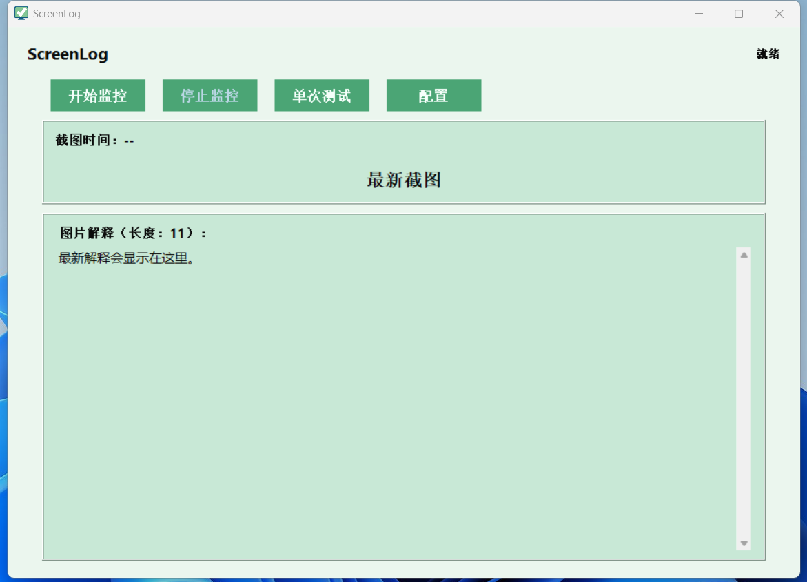
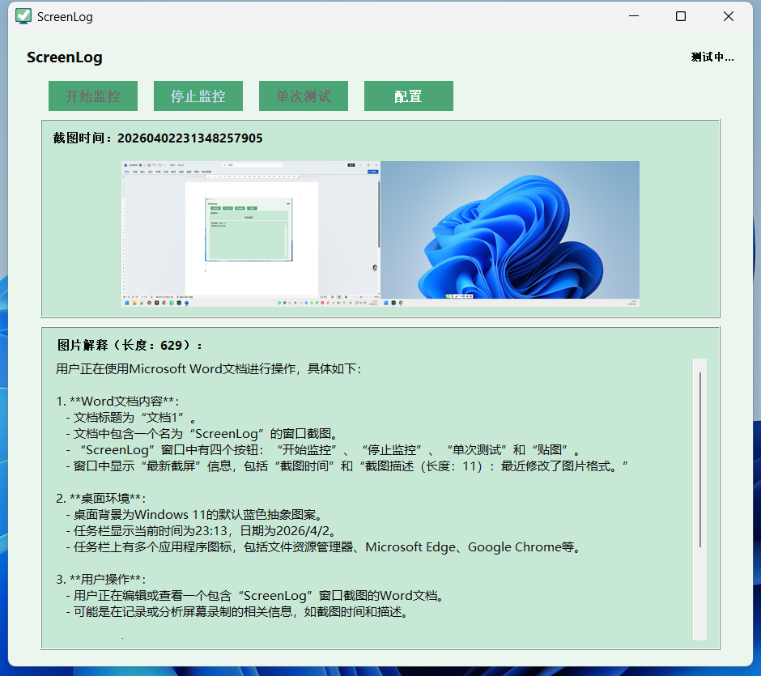
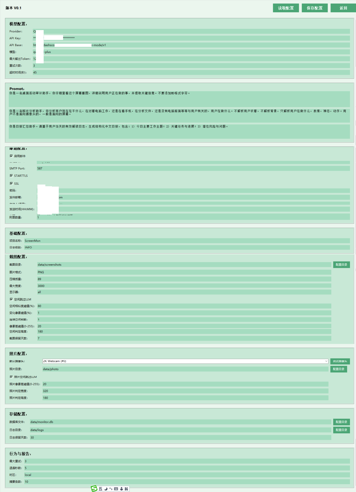
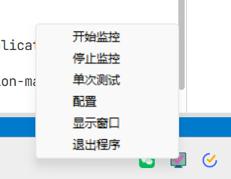

<div align="center">
  <h1>👁️ ScreenMon</h1>
  <p><b>ScreenMon智能屏幕与活动监控分析</b></p>
  <p>
    
    
    
    
  </p>
</div>

## 📖 项目简介

**ScreenMon** 是一个开箱即用的 Windows 桌面智能监控与分析工具。它能在设定的时间窗内定时截屏或调用摄像头拍照，并利用最先进的多模态大语言模型（如 GPT-4o, Qwen-VL 等）实时解读你的屏幕内容或工作状态。

所有解析数据将结构化写入本地 SQLite 数据库与日志中。在每天的指定时间，ScreenMon 会基于当日的“有效解读记录”自动生成 **Markdown 格式的精美日报**，并发送至你的指定邮箱。

无论是**个人效能分析**、**工作量自证**、**沉浸式时间追踪**，还是简单的**设备安全看护**，ScreenMon 都能为你提供无感、智能的记录体验。

### 界面概览

**主界面与日常操作**
主界面由状态栏、按钮区、图像预览区和解释结果区组成。支持开始监控、停止监控、单次测试和快速进入配置等功能。

<p align="center">
  
</p>

**单次测试链路**
单次测试用于验证“截图→模型解读→拍照→模型解读→数据存储”的全链路是否正常。

<p align="center">
  
</p>

**托盘常驻与状态指示**
监控运行后会自动最小化到系统托盘，不打扰正常工作。托盘图标颜色会实时反映当前的运行状态：
- 💚 空闲 (idle)
- 🩷 监控等待 (monitor_idle)
- ❤️ 采集中 (capture)
- 💙 LLM解析 (llm)
- 💛 发送邮件 (email)
- 🩶 异常 (error)

<p align="center">
  
</p>

---

## ✨ 核心特性

- 🤖 **多模态大模型视觉解读**
  - 无缝对接 OpenAI 兼容接口及阿里云 DashScope (Qwen-VL)。
  - 自定义 Prompt，精准提取屏幕活动和照片中的关键信息。
- 💤 **智能空闲检测（省钱利器）**
  - 基于高效的本地图像相似度算法（缩放+像素比对）。
  - 屏幕无变化时自动跳过 LLM 调用，极大节省 API 费用。
- 🎨 **优雅的系统托盘与 GUI**
  - 极简配置界面，常驻系统托盘，不打扰正常工作。
  - 托盘图标颜色实时反映运行状态（💚空闲 🩷监控等待 ❤️采集中 💙LLM解析 💛发送邮件 🩶异常）。
- 📅 **灵活的时间窗与日报系统**
  - 支持自定义监控时段，甚至支持跨天时间段（如 `22:00` 到 `06:00`）。
  - 自动汇总当日有效日志，提炼核心摘要，支持附带核心截图的邮件推送。
- 📷 **双路数据采集**
  - **屏幕截图**：支持多显示器全覆盖或指定显示器。
  - **摄像头拍照**：支持外接或内置 USB 摄像头状态记录。
- 🔒 **隐私与本地优先**
  - 所有原始图像与数据默认仅保留在本地。
  - 自动管理路径可写性，内置日志与过期截图清理机制。

---

## 🚀 快速开始

### 环境要求
- Python 3.11+
- Windows 操作系统（推荐，由于依赖 Windows 特性及 mss 截屏）

### 安装步骤

1. **克隆并进入项目**：
   ```powershell
   git clone https://github.com/yourusername/ScreenMon.git
   cd ScreenMon
   ```

2. **安装依赖**：
   ```powershell
   pip install -r requirements.txt
   ```

3. **准备配置文件**：
   ```powershell
   copy config.example.yaml config.yaml
   ```
   *(请使用文本编辑器打开 `config.yaml` 填入你的 LLM API Key 等配置信息)*

4. **启动 ScreenMon**：
   ```powershell
   python -m screenmon --config config.yaml --gui
   ```

### 💻 运行模式一览

| 模式 | 命令 | 适用场景 |
|------|------|----------|
| **GUI 模式** | `python -m screenmon --config config.yaml --gui` | 日常使用，带系统托盘和配置界面 |
| **后台模式** | `python -m screenmon --config config.yaml` | 无头环境、开机自启或纯后台静默运行 |
| **单次运行** | `python -m screenmon --config config.yaml --run-once` | 调试测试：执行一次“截图→解读→入库”全流程后退出 |

---

## ⚙️ 核心配置说明

配置文件 `config.yaml` 采用结构化设计，支持直接在 GUI 中通过配置面板进行修改。

<p align="center">
  
</p>

### 1. 接入大模型 (LLM)

**OpenAI 兼容接口示例**：
```yaml
llm:
  provider: openai
  api_key: "sk-xxxxxx"
  api_base: "https://api.openai.com/v1"
  model: "gpt-4o-mini"
```

**阿里云 DashScope (Qwen-VL) 示例**：
```yaml
llm:
  provider: dashscope
  api_key: "sk-xxxxxx"
  api_base: "https://dashscope.aliyuncs.com/compatible-mode/v1"
  model: "qwen-vl-plus" # 注意：视觉模型
```

### 2. 智能空闲检测配置
在 `capture` 节点下开启，避免挂机时浪费 Token：
```yaml
capture:
  idle_skip_enabled: true           # 开启空闲检测
  idle_similarity_percent: 98       # 相似度达到 98% 视为无变化
  idle_changed_percent: 1           # 变化像素比例 < 1%
  idle_consecutive_frames: 1        # 连续 1 帧无变化即判定为空闲
```

### 3. 日报与邮件推送
在 `email` 节点下配置你的 SMTP 邮箱：
```yaml
email:
  enabled: true
  smtp_host: smtp.qq.com            # 以 QQ 邮箱为例
  smtp_port: 465
  use_tls: false
  use_ssl: true
  username: "your_qq@qq.com"
  password: "your_auth_code"        # 授权码而非登录密码
  from_addr: "your_qq@qq.com"
  to_addrs:
    - "target@example.com"
  send_time: "23:30"                # 每天晚上 11:30 发送日报
  attach_top_screenshots: 3         # 邮件中附带最具代表性的 3 张截图
```

---

## 📁 产物与数据结构

运行后，ScreenMon 会在 `data/` 目录下生成相关文件：

| 文件/目录 | 说明 |
|-----------|------|
| `monitor.db` | SQLite 数据库，持久化存储所有结构化的快照记录。 |
| `screenshots/` | 屏幕截图留存（默认保留 7 天，自动清理）。 |
| `photo/` | 摄像头照片留存。 |
| `logs/app_*.log` | 应用程序本身的运行日志，用于排错。 |
| `logs/valid_*.log` | 经过 LLM 解读出的**有效记录**（JSON Lines 格式）。 |
| `logs/summary_*.md` | 最终生成的 **Markdown 格式每日汇总报告**。 |
| `logs/monitor_state.json` | 当前运行状态（供 GUI 实时读取更新托盘图标）。 |

---

## 🛠️ 开发与测试

欢迎提交 Pull Request 共同完善项目！

```powershell
# 运行全量单元测试
python -m unittest discover -s tests -p "test_*.py" -v

# 语法检查与编译验证
python -m py_compile screenmon/config.py screenmon/gui.py screenmon/app.py
```

---

## ❓ 常见问题 (FAQ)

**Q: OpenAI 兼容接口报错 404？**
- 请检查 `api_base` 是否补全了版本号（如 `/v1`）。如果使用 DashScope，国内站地址为 `https://dashscope.aliyuncs.com/compatible-mode/v1`。同时请确保模型名称与提供商匹配。

**Q: 邮件发送一直失败？**
- 大多数主流邮箱（如 QQ、163、Gmail）都要求使用**应用专属密码/授权码**而非网页登录密码。同时请检查对应的 SSL/TLS 端口设置。

**Q: 摄像头无法打开或采集黑屏？**
- 请确保系统中安装了 `opencv-python`。你可以在 GUI 的配置窗口中使用“测试摄像头”功能来排查。如果有多摄，可以在配置中指定 `default_camera: 0` 或 `1`。

---

## ⚠️ 免责声明

- **合规使用**：本项目涉及屏幕抓取、摄像头拍照及数据外发（调用 LLM 和发邮件）。**请务必在获得明确授权的设备和场景下使用（如个人电脑自我追踪）**，严禁用于非法监控或侵犯他人隐私。
- **数据安全**：请妥善保管你的 `config.yaml`（尤其是 API Key 和邮箱授权码），不要将其提交到公开的代码仓库。建议配置应用密码而非真实邮箱密码。

## 📄 License

本项目基于 [MIT License](LICENSE) 开源。
